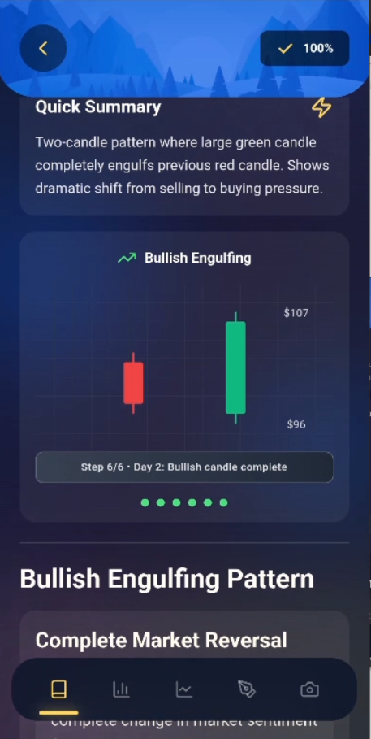
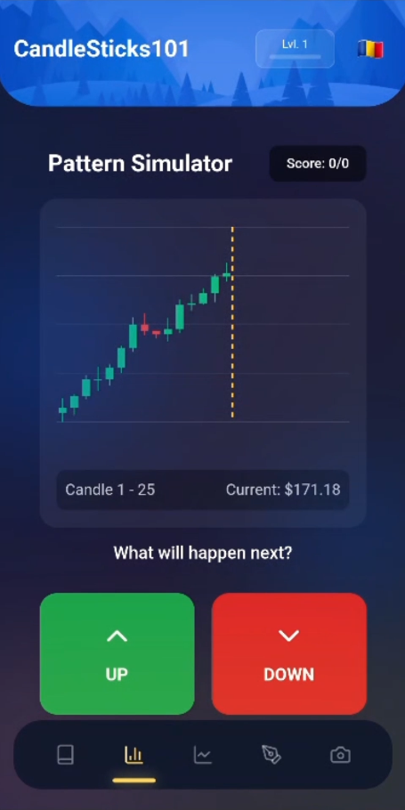
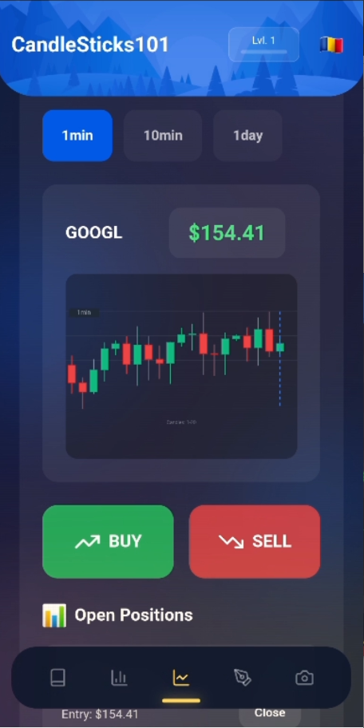
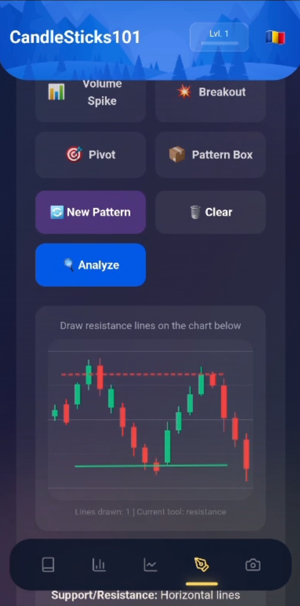
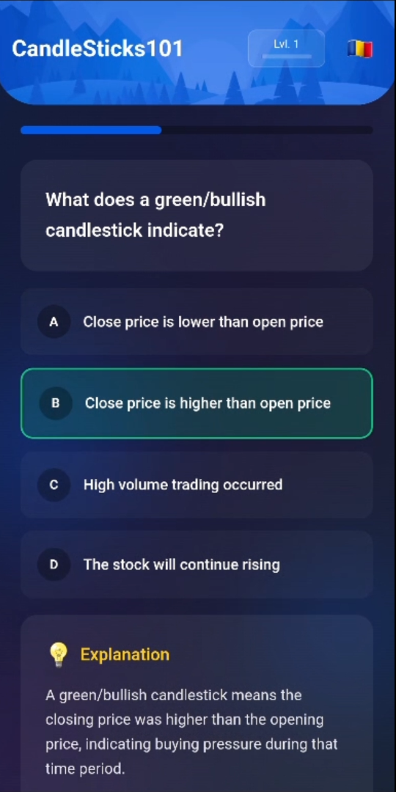
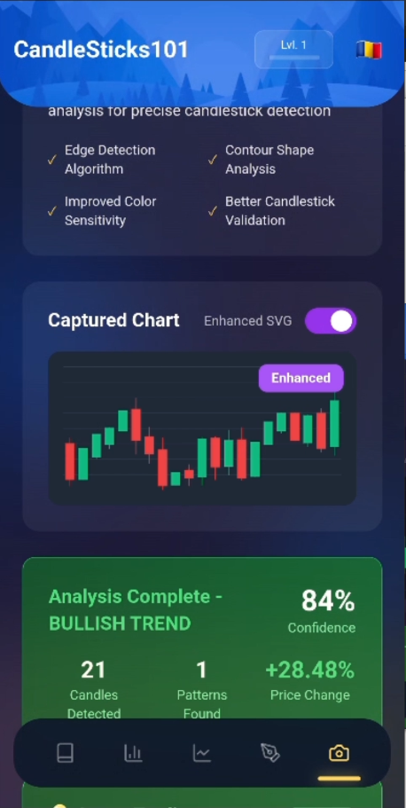

# Candlesticks101

A mobile application that teaches candlestick trading patterns and basic technical analysis. Built as a single-developer project using React on the web layer and Capacitor for the Android shell, and published on Google Play.

**Live site:** https://davidalexilie.github.io/app/
**Google Play:** https://play.google.com/store/apps/details?id=com.david.candlesticks101

## Overview

Candlesticks101 is an educational tool aimed at beginner-to-intermediate traders. It bundles structured lessons, an interactive simulator, a chart-drawing exercise and a camera-based pattern scanner into a single mobile app, so users can practice with the same patterns and tools professional traders use, without putting capital at risk.

## Screenshots

| Lessons | Simulator | Market |
| :---: | :---: | :---: |
|  |  |  |

| Drawing | Quiz | Scanner |
| :---: | :---: | :---: |
|  |  |  |

## Features

### Educational lessons
Five categories: basics, bullish patterns, bearish patterns, technical indicators, and fundamental analysis. Each lesson is delivered as an interactive lecture with worked examples and beginner-friendly explanations of trading terminology.

### Interactive simulator
Animated candlestick reveals at fixed intervals, up/down prediction prompts with a running score, and continuous chart progression so patterns flow naturally. Adaptive scrolling keeps the active decision point visible at all times.

### Real market data
Live data feed for major tickers (AAPL, GOOGL, MSFT, TSLA and others), customizable watchlist, and 30-day candlestick charts with summary statistics. Real data can be piped into the simulator for practice on actual price action.

### Chart drawing practice
Pre-generated patterns including Double Bottom, Ascending Triangle, and Bull Flag, with four drawing tools (support, resistance, trendline, channel). The user's drawing is graded against the expected geometry, with feedback on what was correct and what was missed.

### Pattern scanner
Live camera capture or photo upload of a chart on screen. The captured image is processed by a YOLO-based detection service and returns identified patterns with a confidence score and a short trading note.

## Tech stack

- **Frontend:** React with hooks, React 19
- **Styling:** Tailwind CSS
- **Mobile shell:** Capacitor (Android)
- **Charts:** lightweight-charts, @react-financial-charts
- **ML on-device:** TensorFlow.js (TFJS)
- **Canvas:** HTML5 Canvas for drawing and chart rendering
- **Camera:** Web Camera API via Capacitor Camera plugin
- **Backend (pattern scanner):** Python FastAPI service using a YOLO model, in `chart-analyzer-api/`
- **Monetization:** Capacitor AdMob plugin

## Repository layout

| Path | Purpose |
| --- | --- |
| `src/` | React app source. Entry point is `App.js`. |
| `public/` | Static assets and the HTML shell. |
| `android/` | Capacitor Android project. |
| `chart-analyzer-api/` | FastAPI service that backs the Pattern Scanner. |
| `screenshots/` | Marketing screenshots used in this README. |
| `capacitor.config.ts` | Capacitor configuration. |
| `tailwind.config.js` | Tailwind theme. |

## Local development

Prerequisites: Node.js 18+ and a JDK 17 installation if building the Android project.

```bash
npm install
npm start
```

To produce the Android build:

```bash
npm run build
npx cap sync android
npx cap open android
```

The Pattern Scanner backend lives in `chart-analyzer-api/` and is run separately:

```bash
cd chart-analyzer-api
pip install -r requirements.txt
uvicorn main:app --reload
```

## Status

All planned features are implemented and the app is live on Google Play. Maintained as a single-developer project; ongoing work focuses on content updates and pattern coverage rather than new top-level features.

## Author

David Ilie - [github.com/DavidAlexIlie](https://github.com/DavidAlexIlie) - [davidalexilie.github.io](https://davidalexilie.github.io/)
